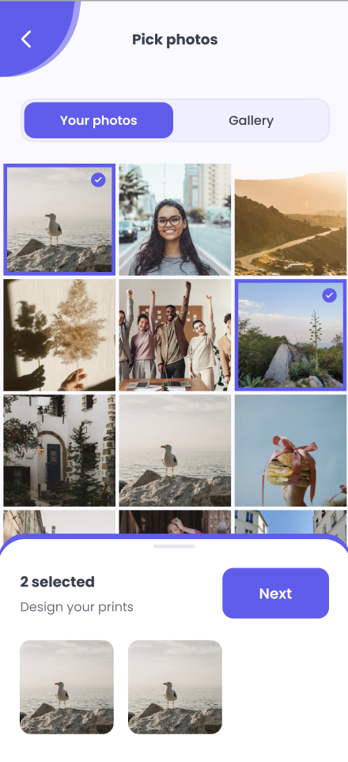

# Loha 📷🎨

# Description
Introducing **_Loha_**, the groundbreaking mobile app revolutionizing the art and photography scene. Easily order custom prints, artwork, and photo albums right from your phone, with options for size and frame preference. Explore a diverse collection of high-quality visuals from talented photographers, artists, and calligraphers. Whether it's breathtaking landscapes, stunning artwork, or intricate calligraphy, Loha offers something for everyone. Plus, unleash your creativity by uploading your own photos to be transformed into beautifully printed and framed pieces. Enjoy a seamless experience from browsing to delivery, with every detail handled with care and efficiency by our app. Your chosen artwork or photographs will be printed and delivered straight to your doorstep.

## Responsibilites

- Spearheaded backend development for Loha, a groundbreaking mobile app revolutionizing the art and photography scene.

- Engineered robust backend systems to seamlessly manage orders for custom prints, artwork, and photo albums, offering options for size and frame preference.

- Implemented advanced algorithms to curate a diverse collection of high-quality visuals from photographers, artists, and calligraphers.the subjects they have.

## Used Technologies

- FastifyJS (Node.js framework)
- PostgreSQL.
- Amazon web services.
    - EC2
    - S3
    - RDS.
    - Auto scaling.
    - Elastic Beanstalk.
    - Lambda.

## Mobile App Screenshots: 

## Dasboard Screenshots:

